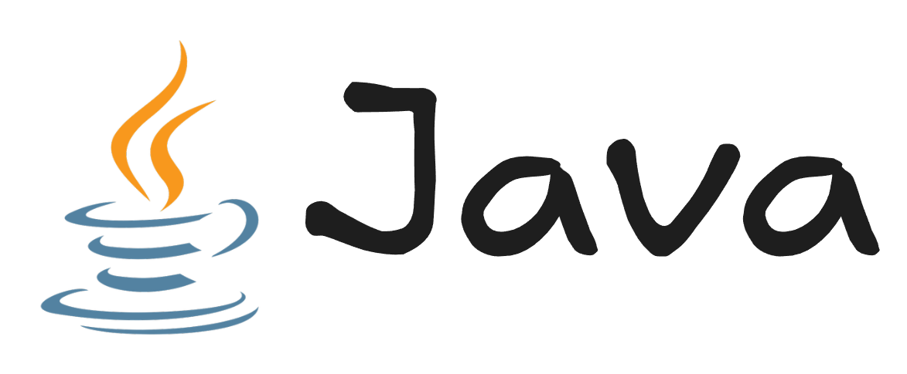

Java es un **lenguaje de programación de alto nivel y orientado a objetos**, diseñado para ser **portátil, seguro y robusto**.

## **Características principales**:

* **"Write Once, Run Anywhere" (WORA):**
  El código Java se compila a bytecode que se ejecuta en la Máquina Virtual de Java (JVM), permitiendo que el mismo programa corra en Windows, Linux, macOS o cualquier sistema con JVM.

* **Orientación a objetos:**
  Basado en objetos y clases, facilita la reutilización, modularidad y organización del código.

* **Gestión automática de memoria:**
  Su recolector de basura (garbage collector) libera memoria automáticamente, evitando fugas y errores comunes.

* **Seguridad:**
  Incluye mecanismos para prevenir accesos no autorizados y ataques, lo que lo hace ideal para aplicaciones críticas.

* **Amplia biblioteca estándar:**
  Proporciona APIs para redes, bases de datos, interfaces gráficas, entre otras funcionalidades.

## **Recursos**:

* [HolasMundo - Youtube](https://youtu.be/b0NHh8RNWK4)

* [Roadmap Java](https://roadmap.sh/java)
